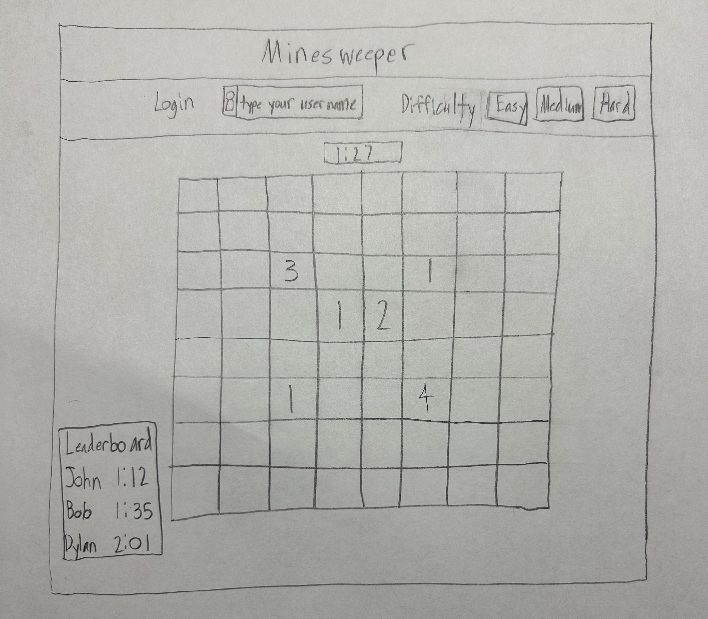
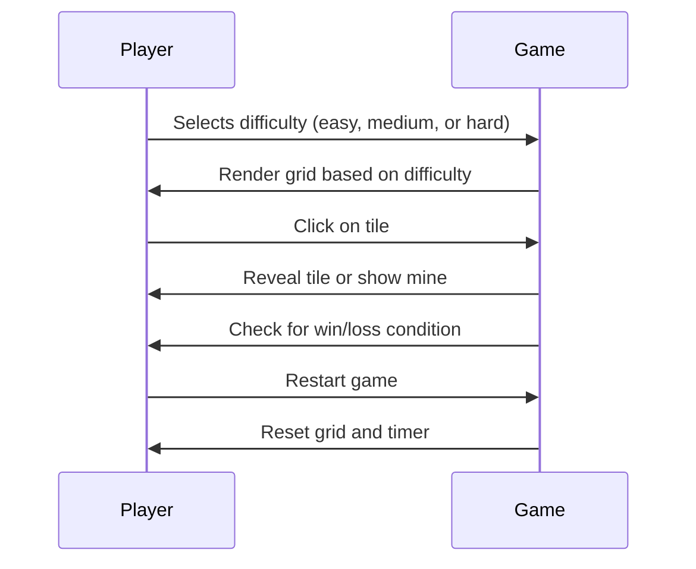

# Minesweeper

This app will allow users to play the popular game we all know and love: Minesweeper.

## 🚀 Specification Deliverable

### Elevator pitch

One of the greatest online games to ever be created is Minesweeper. It is simple, yet challenging, as players compete against each other to flip over tiles that (hopefully) do not contain a mine. Using numbers to guide them along and testing one's logical thinking, see if you can best your friends in this addicting game. Just remember: don't touch the mines...

### Design

- Game Board: The grid where the game will be played (tiles will be revealed or flagged).
- Timer: The timer starts once the game begins, tracking how long the player takes.
- Mine Counter: A counter showing how many mines are left for the player to flag.
- Restart Button: After the game ends (either win or loss), a button will be available to restart the game.
- Grid Layout: The grid adjusts based on the difficulty level (e.g., 8x8 for easy, 16x16 for medium, 24x24 for hard).

Here is a sequence diagram that shows how users would interact with the backend to play the game.

### Key features

- Secure login over HTTPS
- Dynamic Grid: The game features three difficulty levels with different grid sizes (e.g., 8x8, 16x16, 24x24).
- Game Logic: The app must implement all the basic Minesweeper logic, including mine placement, tile revealing, flagging, and win/loss detection.
- Timer: Tracks how long the player takes to finish the game, and stops when the player wins or loses.
- Mine Counter: Displays the number of mines remaining to be flagged. The counter decreases as flags are placed.
- Responsive Design: The layout adjusts to different screen sizes, providing a consistent experience on both mobile and desktop.
- Game Reset: A button that allows players to restart the game without reloading the page.
- Win/Loss Detection: The game will automatically detect whether the player has won (all safe tiles revealed) or lost (a mine has been triggered).
- Multiplayer: Real-time multiplayer functionality, allowing players to play together and see each other’s progress.
- Leaderboard: Tracks high scores or fastest times and displays them in a leaderboard.

### Technologies

I am going to use the required technologies in the following ways:

- **HTML** - HTML will be used to structure the game page. There will be a main game board (using 
 elements for tiles) along with UI elements like the timer, mine counter, and restart button. The HTML will also ensure accessibility and a clean, readable structure.
- **CSS** - CSS will be used to style the application, ensuring it is visually appealing and responsive across different devices. I will create the game grid and ensure that the layout works well on both desktop and mobile.
- **React** - React will be used to manage the game’s state and UI components. The game logic will be modularized into React components (e.g., GameBoard, Tile, Timer, and MineCounter). React will help maintain the state of the game (e.g., tiles being revealed, timer counting down) and allow for quick re-renders when necessary.
- **Service** - I will use an external API to bring additional dynamic features to the game, like fetching a random background for the game grid or providing game-related trivia. For example, a random image API to give the game a unique background for every session.
- **DB/Login** - To allow players to log in and track their high scores or times, I will implement a user authentication system. This could involve creating an account with a username and password, and securely storing credentials with JWT tokens. Also, I will use MongoDB (or another database) to store user data, high scores, and game settings if users are logged in. This allows players to have persistent game data, such as their high scores or selected difficulty.
- **WebSocket** - If multiplayer is implemented, I will use WebSockets to facilitate real-time communication between players. This allows one player's actions to be seen by others immediately, creating a live multiplayer experience.

For this deliverable I did the following. I checked the box `[x]` and added a description for things I completed.

- [x] Proper use of Markdown
- [x] A concise and compelling elevator pitch
- [x] Description of key features
- [x] Description of how you will use each technology
- [x] One or more rough sketches of your application. Images must be embedded in this file using Markdown image references.
